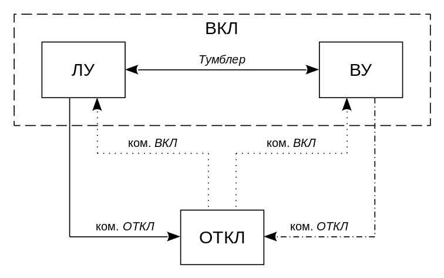
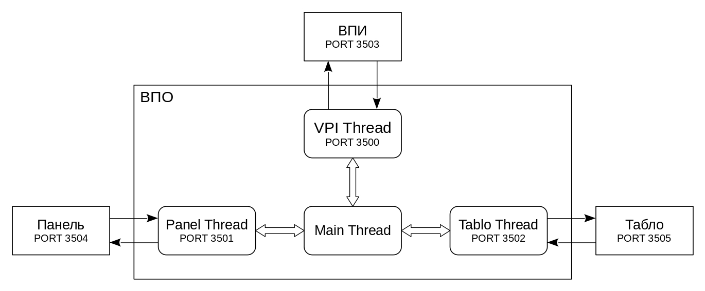

# Device
Система с множественным управлением (СМУ).

- [Состав системы и приницы работы](#Info)
  - [Общая структура](#Structure)
    - [ВПО](#VPO)
    - [Табло](#Tablo)
    - [ВПИ](#VPI)
    - [Панель](#Panel)
  - [Информационный обмен](#Exchange)
- [Требования](#Requirements)
- [Скачивание и сборка](#Building)
- [Использование](#Usage)

<a name="Info"/><h3>Состав системы и приницы работы</h3>
<a name="Structure"/><h4>Общая структура</h4>
СМУ состоит из трех физических объектов: Устройства (осноной объект), ЭВМ и Внешних абонентов. Программное обеспечение СМУ состоит из четрех взаимозависимых компонентов: внешнего пользовательского интерфеса (ВПИ), встраиваемого программного обеспечения (ВПО), передней Панели Устройства, и Табло. Связи между компонентами, а также языки программирования и библиотеки, с помощью которых они реализованы, показаны на Рисунке 1.

<em>Рисунок 1</em>

Рассмотрим подробнее каждый из компонентов.

<a name="VPO"/><h5>ВПО</h5>
ВПО (встраиваемое прораммное обеспечение) - основной компонент встраиваемой программы Устройства и СМУ, является главным связующим звеном всего СМУ. К основным задачам и функциям работы ВПО можно отнести:
1. Управление [Табло](#Tablo) с помощью сетевых интерфейсов.
2. Обеспечение связи с передней [Панелью](#Panel) Устройства.
3. Сетевое взаимодействие с [ВПИ](#VPI).
4. Автономная работа без средств управления (ВПИ и Панель).
5. Отработка различных режимов и состояний работы Устройства.

Устройство, в состав которого входит ВПО, может находиться в одном из двух состояний: ОТКЛ/ВКЛ (отключено/включено). В состоянии ОТКЛ ВПО никак не взаимодействует с другими компонентами, за исключением отработки команды "Включить" от ВПИ или передней Панели. В состоянии ВКЛ ВПО выполняет свои целевые функции в полном объеме.  
А также в одном из следующих режимов: ЛУ/ВУ (локальное управление/внешнее управление). В состоянии ЛУ ВПО отрабатывает команды, полученные от передней Панели, и игнорирует команды, пришедшие от ВПИ. В состоянии ВУ ВПО отрабатывает команды, полученные от ВПИ, и игнорирует команды, пришедшие от Панели. Нахождение Устройства в состоянии ЛУ/ВУ регулируется переключателем (далее по тексту - <em>тумблер</em>) на передней Панели.  
Граф режимов и состояний Устройства изображен на Рисунке 2. На Рисунке 2 сплошные стрелки обозначают команды, получаемые от передней Панели; штрих-пунктирные - команды от ВПИ; пунктирные - команды от ВПИ или от Панели.

<em>Рисунок 2</em>

Архитектура программного компонента ВПО представлена на Рисунке 3. Она состоит из четырех потоков: Main Thread (отвечает за взаимодействие с другими потоками и вычисление своего состояния и режимов работы), VPI Thread (отвечает за сетевое взаимодействие с ВПИ - прием/отправка сообщений), Panel Thread (отвечает за взаимодействие с Панелью), Tablo Thread (отвечает за сетевое взаимодействие с Табло). Блочные стрелки показывают взаимодействие между потоками на основе шины (множества переменных и сигналов); тонкие стрелки обозначают пересылку исключительно сетевых сообщений на основе открытых сокетов.

<em>Рисунок 3</em>

<a name="Tablo"/><h5>Табло</h5>
Табло - группа из 8 индикационных устройств, являющихся внешними абонентами по отношению к остальной части СМУ. Каждое Табло находится в одном из двух состояний: ОТКЛ (отключено) или ВКЛ (включено), а также в одном или комбинации из следующих режимов: RED, YELLOW, GREEN. Табло находится в состоянии включено, если оно перед этим получило команду на включение от ВПО. Табло находится в определенном режиме(-ах), если при получении от ВПО указан соответствующий режим(-ы).

<a name="VPI"/><h5>ВПИ</h5>
В разработке

<a name="Panel"/><h5>Панель</h5>
В разработке

<a name="Exchange"/><h4>Информационный обмен</h4>
В разработке

<a name="Requirements"/><h3>Требования</h3>
В разработке

<a name="Building"/><h3>Скачивание и сборка</h3>
В разработке

<a name="Usage"/><h3>Использование</h3>
В разработке

***
[comment]: <> (

)

<a href="https://github.com/VasiliyMatlab">VasiliyMatlab</a>

