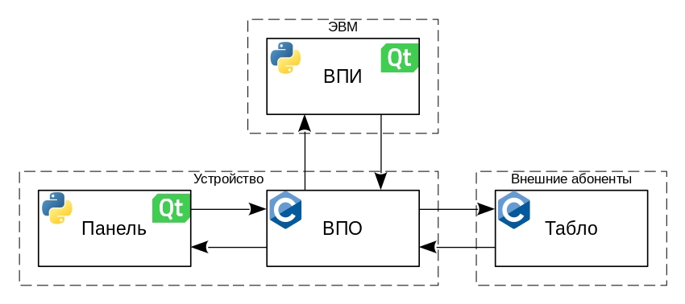

# Device
Управляемое устройство с распределенным управлением (УУРУ).

- [Состав устройства и приницы работы](#Info)
  - [Общая структура](#Structure)
    - [ВПО](#VPO)
    - [Табло](#Tablo)
    - [ВПИ](#VPI)
    - [Панель](#Panel)
  - [Режимы работы](#Modes)
  - [Сетевые сообщения](#Messages)
- [Требования](#Requirements)
- [Скачивание и сборка](#Building)
- [Использование](#Usage)

<a name="Info"/><h3>Состав устройства и приницы работы</h3>
<a name="Structure"/><h4>Общая структура</h4>
УУРУ состоит из четрех взаимозависимых компонентов: внешнего пользовательского
интерфеса (ВПИ), встраиваемого программного обеспечения (ВПО), передней панели,
и табло. Связи между компонентами, а также языки программирования и библиотеки,
с помощью которых они реализованы, показаны на Рисунке 1.

<em>Рисунок 1</em>

Рассмотрим подробнее каждый из компонентов.

<a name="VPO"/><h5>ВПО</h5>
В разработке

<a name="Tablo"/><h5>Табло</h5>
В разработке

<a name="VPI"/><h5>ВПИ</h5>
В разработке

<a name="Panel"/><h5>Панель</h5>
В разработке

<a name="Modes"/><h4>Режимы работы</h4>
В разработке

<a name="Messages"/><h4>Сетевые сообщения</h4>
В разработке

<a name="Requirements"/><h3>Требования</h3>
В разработке

<a name="Building"/><h3>Скачивание и сборка</h3>
В разработке

<a name="Usage"/><h3>Использование</h3>
В разработке

***
[comment]: <> (

)

<a href="https://github.com/VasiliyMatlab">VasiliyMatlab</a>

